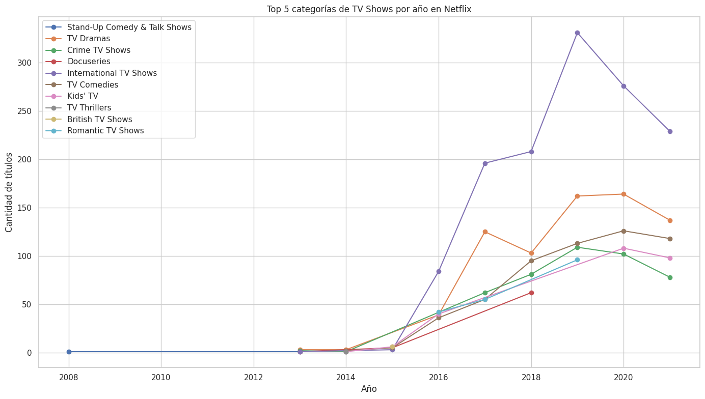

# netflix-tvshow-data-analysis
# 📺 Análisis del Catálogo de Netflix: Enfoque en TV Shows

Este proyecto realiza un análisis exploratorio de datos (EDA) enfocado exclusivamente en los títulos tipo "TV Show" del catálogo de Netflix. A través de visualizaciones, buscamos identificar tendencias, evolución temporal y las categorías más frecuentes en distintas regiones. Es un proyecto educativo desarrollado con fines de práctica y portafolio.

## 📁 Dataset

- Fuente: Kaggle — [`netflix_titles.csv`](https://www.kaggle.com/datasets/shivamb/netflix-shows)
- Columnas clave utilizadas: `type`, `date_added`, `listed_in`

## 🛠️ Tecnologías usadas

- Python
- Pandas
- NumPy
- Matplotlib
- Seaborn
- Google Colab

## 🔍 Objetivo

- Analizar la evolución del contenido tipo TV Show en Netflix.
- Visualizar las categorías más populares por año.

## 📊 Resultados destacados

- 📈 Observamos un aumento progresivo de títulos como TV Show a partir de 2015, con un pico en 2019.
- 🌎 Una de las categorías más comunes fueron: *International TV Shows*, *Dramas*, *Comedies* y *Reality TV*.
- 🎯 Se observa una estrategia de diversificación de contenido a nivel global.

## 🖼️ Vista previa

## 👩‍💻 Autora

**Lauris Olivares** — *Data Engineer en formación*  
📍 USA | 💻 Proyecto educativo para portafolio  
🔗 [GitHub](https://github.com/laurisolivares-dev)

## 🔗 Ver el análisis completo
📘 [Haz clic aquí para abrir el notebook](./Netflix_Data_Analysis.ipynb)
